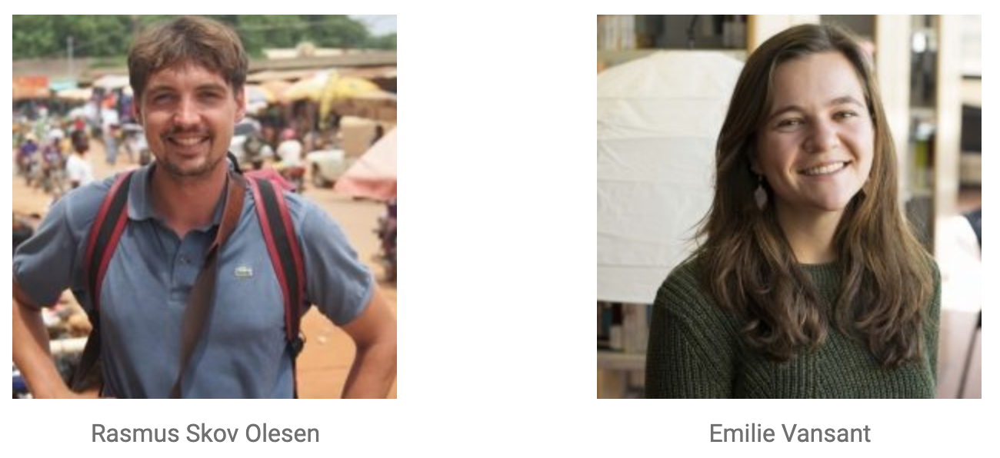

# FORESTDIET
FORESTDIET repo for the SESYNC Summer Institute 2020

This is the public GitHub managed by Rasmus and Emilie for the 2020 SESYNC Computational Summer Institute. We are two PhD students at the University of Copenhagen, and we will be using the data science skills we learn through the SESYNC institute to examine panel data describing nutrition and forest-related attributes of sampled households in Tanzania as part of FORESTDIET, a project funded by the European Research Council.

The flagship strategy to feed the world continues to be to increase agricultural production (and clear forest) to produce more calories. Yet, our recent research suggests that people who live in a forested landscape consume healthier foods than those who do not live near forests. Therefore, our aim is to further explore the relationships between forest cover change and people’s dietary quality in low-income countries. The findings are expected to lay the groundwork for a shift in how we think about pathways to food security – moving from conceptualizing food security as driven by agriculture alone to seeing it as dependent on socio-ecological interactions at the forest-agriculture nexus.

Our Data:
https://emvansant.github.io/FORESTDIET_SESYNC/map1.html

